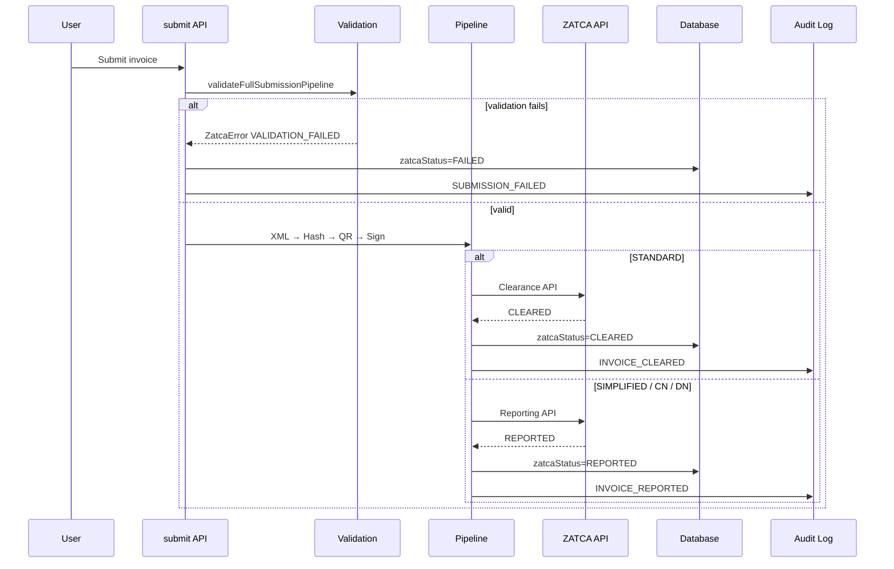

# ZATCA Day 6 — Testing, Monitoring & Production Readiness

**Project:** hisab.ai  
**Phase:** ZATCA Phase 2 — Day 6  
**Date:** 2026-06-10

Day 6 operationalizes the ZATCA integration built in Days 1–5: automated sandbox testing, validation hardening, monitoring dashboard, audit logging, failure handling, and production readiness documentation.

---

## Architecture

```mermaid
flowchart TB
  subgraph UI
    INV[Invoices Page]
    ZD[/zatca Dashboard]
    SET[Settings / Tax]
  end

  subgraph API
    SUB[POST .../submit]
    DASH[GET /api/zatca/dashboard]
    SBX[POST /api/zatca/sandbox/run]
    XML[GET .../xml | signed-xml | qr]
  end

  subgraph Lib["src/lib/zatca"]
    VAL[validation/hardening]
    GEN[generate + xml]
    HASH[hash]
    QR[qr]
    SIG[signature]
    SUBM[submission]
    AUD[audit/logger]
    MON[monitoring/dashboard]
    TST[testing/sandbox-runner]
    ERR[errors]
  end

  subgraph Data
    INV_DB[(Invoice)]
    AUD_DB[(ZatcaAuditLog)]
    TST_DB[(ZatcaSandboxTestRun)]
    CRED[(ZatcaCredential)]
  end

  INV --> SUB
  INV --> XML
  ZD --> DASH
  ZD --> SBX
  SET --> CRED

  SUB --> VAL --> GEN --> HASH --> QR --> SIG --> SUBM
  SUBM --> AUD
  SBX --> TST
  DASH --> MON
  MON --> INV_DB
  MON --> AUD_DB
  MON --> TST_DB
  SUBM --> ERR
```

---

## Submission Workflow



---

## API Endpoints

### Day 6 (new)

| Method | Path | Description |
|--------|------|-------------|
| `GET` | `/api/zatca/dashboard` | Stats, recent activity, audit logs, sandbox history |
| `POST` | `/api/zatca/sandbox/run` | Run all sandbox E2E scenarios |
| `GET` | `/api/zatca/invoices/[id]/signed-xml` | Signed UBL XML for an invoice |

### Existing (Days 2–5)

| Method | Path | Description |
|--------|------|-------------|
| `GET` | `/api/zatca/invoices/[id]/xml` | Unsigned UBL XML |
| `GET` | `/api/zatca/invoices/[id]/hash` | SHA-256 hash |
| `GET` | `/api/zatca/invoices/[id]/qr` | TLV payload + QR data URL |
| `POST` | `/api/zatca/invoices/[id]/submit` | Full submission workflow |
| `GET` | `/api/zatca/invoices/[id]/status` | ZATCA status summary |
| `GET` | `/api/zatca/invoices/[id]/response` | Raw ZATCA response payload |
| `POST` | `/api/zatca/onboarding/csr` | Generate CSR |
| `POST` | `/api/zatca/onboarding/compliance` | Compliance CSID (OTP) |
| `POST` | `/api/zatca/onboarding/production` | Production CSID |
| `GET` | `/api/zatca/onboarding/status` | Onboarding status |

---

## Database Changes (Day 6)

Migration: `20250610200000_zatca_phase2_day6`

### `ZatcaAuditLog`

| Column | Type | Description |
|--------|------|-------------|
| `action` | String | CSR_GENERATED, COMPLIANCE_CSID_ISSUED, etc. |
| `result` | String | SUCCESS / FAILED |
| `userId`, `userName` | String? | Acting user |
| `companyName` | String? | Company context |
| `invoiceId` | String? | Related invoice |
| `metadata` | String? | JSON details |

### `ZatcaSandboxTestRun`

| Column | Type | Description |
|--------|------|-------------|
| `scenario` | String | STANDARD, SIMPLIFIED, CREDIT_NOTE, DEBIT_NOTE |
| `passed` | Boolean | Overall result |
| `steps` | String | JSON step log |
| `error` | String? | Failure message |
| `durationMs` | Int? | Run duration |

### `Invoice` (added)

| Column | Type | Description |
|--------|------|-------------|
| `zatcaFailureCode` | String? | Structured error code on FAILED |

---

## UI Changes

### `/zatca` — Monitoring Dashboard

- Stat cards: Submitted, Cleared, Reported, Failed, Pending
- Recent activity table: invoice number, type, status, request ID, submission date
- Audit log panel
- Sandbox test history + **Run Sandbox Tests** button

### Invoices — View Modal (enhanced)

- ZATCA status, request ID, submission timestamp
- Response code and message
- Clearance / reporting result
- **View XML**, **View Signed XML**, **View QR** buttons
- Inline QR preview

Nav: **ZATCA Monitor** link under Reports & Tax.

---

## Module Layout (Day 6 additions)

```
src/lib/zatca/
├── audit/logger.ts          # Audit trail
├── errors.ts                # ZatcaError + mapping
├── validation/hardening.ts  # Pre-submission validation
├── monitoring/dashboard.ts  # Dashboard aggregates
├── testing/sandbox-runner.ts # E2E scenarios
```

---

## Environment Variables

```env
DATABASE_URL="file:./dev.db"
ZATCA_CREDENTIAL_ENCRYPTION_KEY=   # Required in production
ZATCA_API_BASE_URL=https://gw-fatoora.zatca.gov.sa
ZATCA_MOCK_ONBOARDING=true         # Local dev only
ZATCA_MOCK_SUBMISSION=true         # Local dev only
```

---

## Deployment Requirements

1. Run migrations: `npx prisma migrate deploy`
2. Set `ZATCA_CREDENTIAL_ENCRYPTION_KEY` before storing credentials in production
3. Disable mock flags (`ZATCA_MOCK_*`) in production
4. Ensure outbound HTTPS to `gw-fatoora.zatca.gov.sa`
5. Use PostgreSQL (or managed DB) for production — see [SUPABASE_MIGRATION.md](./SUPABASE_MIGRATION.md)
6. Restrict `/api/zatca/*` to authenticated users (existing `requireAuth`)

---

## Audit Events

| Action | Trigger |
|--------|---------|
| `CSR_GENERATED` | CSR created via onboarding |
| `COMPLIANCE_CSID_ISSUED` | OTP compliance onboarding success |
| `PRODUCTION_CSID_ISSUED` | Production CSID issued |
| `INVOICE_SUBMITTED` | Submission initiated |
| `INVOICE_CLEARED` | Clearance success |
| `INVOICE_REPORTED` | Reporting success |
| `SUBMISSION_FAILED` | Any submission failure |
| `SANDBOX_TEST_RUN` | Sandbox scenario completed |

---

## Known Limitations

1. **Mock signing** — When `ZATCA_MOCK_SUBMISSION=true`, signatures are digest-based placeholders, not ECDSA. Production must disable mock flags.
2. **No automatic retry** — FAILED invoices require manual resubmission after fixing the root cause.
3. **Single-tenant credentials** — One `ZatcaCredential` row per environment (SANDBOX / PRODUCTION).
4. **SQLite in dev** — Ensure `DATABASE_URL` is consistent between Prisma CLI and the app (`file:./dev.db` vs `file:./prisma/dev.db`).
5. **Certificate expiry** — No proactive alerting; monitor onboarding status manually.

---

## Related Documentation

- [ZATCA_SANDBOX_TEST_RESULTS.md](./ZATCA_SANDBOX_TEST_RESULTS.md)
- [ZATCA_PRODUCTION_READINESS.md](./ZATCA_PRODUCTION_READINESS.md)
- [ZATCA_DAY5_SUBMISSION.md](./ZATCA_DAY5_SUBMISSION.md)
- [ZATCA_DAY4_ONBOARDING.md](./ZATCA_DAY4_ONBOARDING.md)
