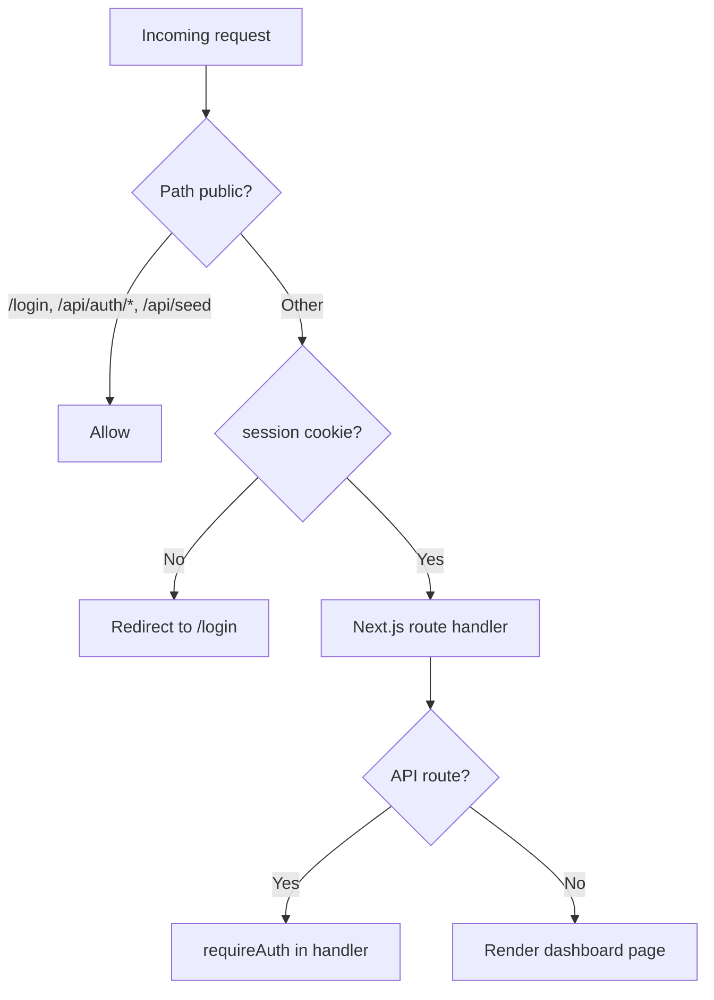
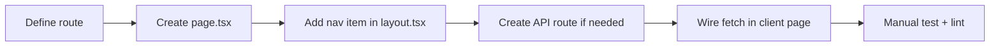
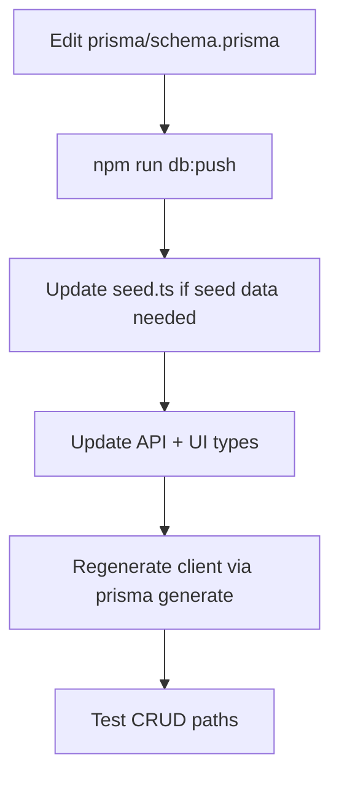
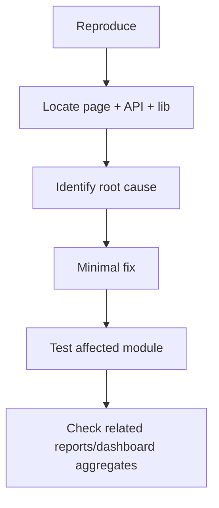
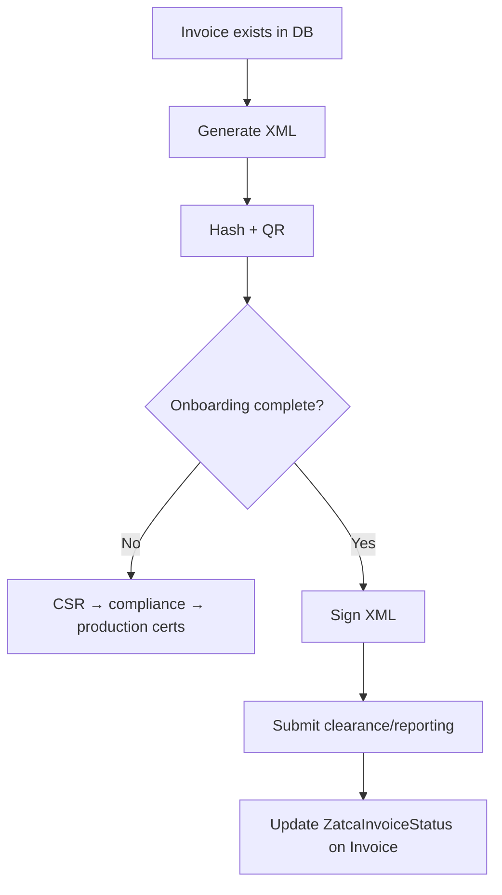
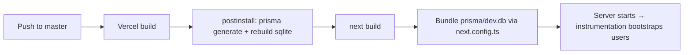

# hisab.ai — Agent Technical Workflow

**Audience:** AI coding agents, automation tools, and senior developers working in this repository.  
**Product:** [hisab.ai](https://github.com/ABDULLAHUMAR020703/hisab.ai) — Saudi-market SMB accounting (SAR, VAT, ZATCA).  
**Version:** 0.1.0 · **Last updated:** June 2026

---

## 0. How to use this document

Read this file **before** making changes. It defines:

1. Where the real project root is and what **not** to touch
2. Standard workflows for features, bugs, schema, ZATCA, and deploy
3. Architecture boundaries agents must respect
4. Verification steps before commit/push

**Companion docs:**

| Doc | When to read |
|-----|----------------|
| [HISAB_AI_PRODUCT_CONTEXT.md](./HISAB_AI_PRODUCT_CONTEXT.md) | Feature inventory, gaps, data model overview |
| [HISAB_AI_STATUS_UPDATE.md](./HISAB_AI_STATUS_UPDATE.md) | Current stakeholder status & ZATCA progress |
| [SUPABASE_MIGRATION.md](./SUPABASE_MIGRATION.md) | Only if switching runtime DB to Postgres |
| [ZATCA_*.md](./README.md) | Any ZATCA/e-invoicing work |
| Root [README.md](../README.md) | Human setup, scripts, demo credentials |

---

## 1. Repository orientation

### 1.1 Workspace vs Git root

| Path | Role |
|------|------|
| `D:\University\Workspace\Financebook\` | Parent folder — **no `package.json`** |
| `D:\University\Workspace\Financebook\financebook\` | **Actual app root** — run all `npm` / `git` here |

**Agent rule:** Always `cd financebook` before `npm run dev`, `npm run db:seed`, `git push`, etc.

### 1.2 Git remote

| Remote | URL |
|--------|-----|
| `origin` | `https://github.com/ABDULLAHUMAR020703/hisab.ai.git` |

Default branch: **`master`**. Vercel deploys from this repo.

### 1.3 Branding source of truth

```ts
// src/lib/brand.ts
PRODUCT_NAME = 'hisab.ai'
DEMO_ADMIN_EMAIL = 'admin@hisab.ai'
DEMO_ACCOUNTANT_EMAIL = 'accountant@hisab.ai'
```

Never hardcode old names (`Quickbook`, `financebook.com`) in new code. Use `brand.ts` or `demo-users.ts`.

### 1.4 Node.js requirement

| Item | Value |
|------|-------|
| `engines.node` | `>=22 <25` |
| `.nvmrc` | `22` |
| Native module | `better-sqlite3` — must match Node (`postinstall` rebuilds it) |

If `db:seed` fails with `NODE_MODULE_VERSION` / `ERR_DLOPEN_FAILED`:

```bash
npm rebuild better-sqlite3
npm run db:seed
```

---

## 2. System architecture (agent mental model)

### 2.1 Stack

```
Browser (React 19 client components)
    ↓ fetch()
Next.js 16 App Router (src/app/)
    ├── (auth)/login          → public
    ├── (dashboard)/*         → guarded by proxy.ts
    └── api/**/route.ts       → REST handlers
    ↓
Prisma 7 + better-sqlite3 adapter
    ↓
SQLite file (prisma/dev.db)
```

**Pattern:** Monolithic full-stack Next.js. No separate API server, no microservices.

### 2.2 Request guard flow



**Files:**

| Concern | File |
|---------|------|
| Route guard | `src/proxy.ts` |
| Session read | `src/lib/auth.ts` → `getSession()` / `requireAuth()` |
| Login | `src/app/api/auth/login/route.ts` |
| DB bootstrap (prod) | `src/instrumentation.ts`, `src/lib/demo-users.ts` |

### 2.3 Database path resolution

| Environment | DB location | Logic |
|-------------|-------------|-------|
| Local dev | `prisma/dev.db` | `src/lib/sqlite-db.ts` |
| Vercel / production | `/tmp/hisab-ai/dev.db` | Copy from bundled `prisma/dev.db` on cold start |

**Agent caution:** Data written on Vercel is **ephemeral** per instance unless you migrate to Postgres (see `SUPABASE_MIGRATION.md`). Do not assume persistent SQLite on serverless.

### 2.4 Next.js 16 specifics

`AGENTS.md` at repo root warns: this Next.js version may differ from training data. Before changing routing, middleware, or App Router APIs:

- Read `node_modules/next/dist/docs/` for current conventions
- Project uses `src/proxy.ts` (not `middleware.ts`) for auth redirects

---

## 3. Agent pre-flight checklist

Run this mental (or literal) checklist **before every task**:

- [ ] Working directory is `financebook/`
- [ ] Read relevant section of this workflow + product context
- [ ] Identified whether change touches **UI**, **API**, **schema**, **ZATCA**, or **infra**
- [ ] Confirmed no `.env`, secrets, or `dev.db` personal data will be committed (unless explicitly requested)
- [ ] Node 22+ available; `better-sqlite3` rebuilt if DB scripts fail
- [ ] Scope is minimal — no drive-by refactors
- [ ] Branding uses `src/lib/brand.ts`

---

## 4. Standard development workflows

### 4.1 Local environment bootstrap

```bash
cd financebook
npm install                    # runs postinstall: prisma generate + rebuild sqlite
cp .env.example .env           # if needed; DATABASE_URL=file:./prisma/dev.db
npm run db:push                # apply schema
npm run db:seed                # COA, users, tax, optional demo transactions
npm run dev                    # http://localhost:3000
```

**Demo login:** `admin@hisab.ai` / `admin123`

**Windows Turbopack issue:** `npm run dev -- --webpack`

### 4.2 Workflow A — Add a new dashboard page



| Step | Action |
|------|--------|
| 1 | Add `src/app/(dashboard)/<module>/page.tsx` (`'use client'` if interactive) |
| 2 | Add link in `src/app/(dashboard)/layout.tsx` `NAV` config |
| 3 | Add `src/app/api/<module>/route.ts` with `requireAuth()` |
| 4 | Reuse UI: `PageHeader`, `DataTable`, `Modal`, `Card`, `Badge` from `src/components/ui/` |
| 5 | Run `npm run lint` |

**Do not** add pages outside `(dashboard)` without updating `proxy.ts` public routes.

### 4.3 Workflow B — Add or change an API endpoint

**Template pattern** (existing convention):

```ts
// src/app/api/<resource>/route.ts
import { prisma } from '@/lib/prisma'
import { requireAuth } from '@/lib/auth'

export async function GET() {
  try {
    await requireAuth()
    const rows = await prisma.<model>.findMany({ ... })
    return Response.json(rows)
  } catch (error) {
    if (error instanceof Error && error.message === 'Unauthorized') {
      return Response.json({ error: 'Unauthorized' }, { status: 401 })
    }
    console.error(error)
    return Response.json({ error: 'Internal server error' }, { status: 500 })
  }
}
```

| Step | Action |
|------|--------|
| 1 | Mirror naming of sibling routes (`route.ts`, `[id]/route.ts`) |
| 2 | Call `requireAuth()` at start (roles **not** enforced — any logged-in user passes) |
| 3 | Use `prisma` from `@/lib/prisma` only — never instantiate second client |
| 4 | Return `Response.json()` with appropriate HTTP status |
| 5 | Update dashboard page `fetch('/api/...')` |

**Document numbers:** Use `src/lib/sequences.ts` for `entryNo`, invoice numbers, etc., when applicable.

### 4.4 Workflow C — Schema / Prisma change



| Step | Command / file |
|------|----------------|
| 1 | Edit `prisma/schema.prisma` |
| 2 | `npm run db:push` (SQLite — no migration files required today) |
| 3 | Update `prisma/seed.ts`, `src/lib/demo-seed.ts` if needed |
| 4 | `postinstall` / `prisma generate` updates `@prisma/client` |
| 5 | If adding ZATCA fields, follow [ZATCA_GAP_ANALYSIS.md](./ZATCA_GAP_ANALYSIS.md) |

**Supabase path:** If `datasource` changes to `postgresql`, follow `SUPABASE_MIGRATION.md` — do not mix SQLite adapter code with Postgres without refactoring `src/lib/prisma.ts`.

### 4.5 Workflow D — Bug fix



| Bug type | First files to inspect |
|----------|------------------------|
| Login / session | `api/auth/login`, `auth.ts`, `demo-users.ts`, `proxy.ts` |
| Wrong totals | API report route + Prisma aggregation query |
| Journal not affecting balances | `api/journal/[id]/post` — **known gap:** status changes only |
| ZATCA submit fail | `src/lib/zatca/submission/*`, invoice ZATCA fields, onboarding credentials |
| Vercel-only issue | `sqlite-db.ts`, `instrumentation.ts`, `next.config.ts` tracing |

### 4.6 Workflow E — Demo / seed data

| Entry point | Purpose |
|-------------|---------|
| `npm run db:seed` | CLI seed — COA, users, tax, cost centers |
| `POST /api/seed` | Dashboard “Load sample data” — includes `seedDemoTransactions()` |
| `src/lib/demo-seed.ts` | Demo customers, invoices, bills, etc. |
| `src/lib/demo-users.ts` | Migrate/create `@hisab.ai` users |

**Rule:** `ensureDemoUsers()` is idempotent — safe on login and server start.

---

## 5. ZATCA workflow (e-invoicing)

ZATCA is a **major subsystem**. Do not modify invoice submission without reading ZATCA docs.

### 5.1 Module map

```
src/lib/zatca/
├── xml/           UBL 2.1 XML build + validate
├── hash/          SHA-256, invoice hash chain
├── qr/            TLV QR generation
├── signature/     XML signing, canonicalization
├── onboarding/    CSR, compliance/production credentials
├── submission/    Clearance & reporting APIs
├── validation/    Compliance checks, hardening
├── audit/         Audit logging
├── monitoring/    Dashboard metrics
└── invoice-service.ts  Orchestration entry points

src/app/api/zatca/**     16 API routes
src/app/(dashboard)/zatca/page.tsx   UI dashboard
```

### 5.2 ZATCA agent workflow



| Phase | Doc | Key endpoints |
|-------|-----|----------------|
| Schema gaps | ZATCA_GAP_ANALYSIS.md | Prisma enums/models |
| XML | ZATCA_DAY2_XML.md | `GET /api/zatca/invoices/[id]/xml` |
| Hash/QR | ZATCA_DAY3_HASH_QR.md | `/hash`, `/qr` |
| Onboarding | ZATCA_DAY4_ONBOARDING.md | `/api/zatca/onboarding/*` |
| Submission | ZATCA_DAY5_SUBMISSION.md | `/submit`, `/status` |
| E2E / prod | ZATCA_DAY6_FINAL.md, ZATCA_RELEASE_CHECKLIST.md | `/sandbox/run` |

**Agent rules for ZATCA:**

1. Never store production CSID/secrets in git — use env vars / credential store (`src/lib/zatca/onboarding/credential-store.ts`)
2. Test in **SANDBOX** before PRODUCTION enum
3. Update audit logger when adding submission paths
4. Run compliance-check before submit when applicable

---

## 6. Authentication & security workflow

### 6.1 Session lifecycle

| Event | Behavior |
|-------|----------|
| Login | `bcrypt.compare` → create `AppSession` → `Set-Cookie: session=<token>` |
| Cookie flags | `HttpOnly`, `SameSite=Lax`, `Secure` in production |
| API access | `requireAuth()` reads cookie via `cookies()` |
| Logout | Delete session row + clear cookie |

### 6.2 What is NOT implemented

| Gap | Implication for agents |
|-----|------------------------|
| Role-based API enforcement | `ADMIN` vs `ACCOUNTANT` is cosmetic at API layer |
| NextAuth | Packages exist but unused — keep custom auth unless migrating |
| Rate limiting | Not present on login |
| CSRF tokens | Relies on SameSite cookie |

**Do not** commit real passwords, ZATCA OTPs, or CSRs with private keys.

---

## 7. UI component workflow

### 7.1 Design system

| Layer | Location |
|-------|----------|
| Primitives | `src/components/ui/` — Button, Card, DataTable, Modal, Input, Badge, PageHeader |
| CSV import | `src/components/ui/csv-import.tsx` (if present) |
| Styling | Tailwind CSS 4, dashboard dark sidebar in `layout.tsx` |
| Icons | `lucide-react` |
| Charts | `recharts` on dashboard + reports |

### 7.2 Page conventions

- Dashboard pages are mostly **client components** (`'use client'`)
- Data loaded via `useEffect` + `fetch('/api/...')`
- Currency: `formatCurrency()` from `src/lib/utils.ts` (SAR)
- Dates: `formatDate()` / `date-fns`

---

## 8. Reports & accounting logic workflow

Reports read transactional data via dedicated API routes — they do **not** share one generic report engine.

| Report | API | Data dependency |
|--------|-----|-----------------|
| P&L | `/api/reports/profit-loss` | Income/expense accounts, invoices, bills |
| Balance sheet | `/api/reports/balance-sheet` | Account balances |
| General ledger | `/api/reports/general-ledger` | Journal lines |
| Cash flow | `/api/reports/cash-flow` | Invoice/bill **payments** |

**Known limitation:** `POST /api/journal/[id]/post` sets status to `POSTED` but does **not** update `ChartOfAccount.balance`. Agents fixing “wrong GL balance” must address this explicitly — not just re-run reports.

---

## 9. Build, test, and deploy workflow

### 9.1 Scripts

| Script | Agent use |
|--------|-----------|
| `npm run dev` | Local development |
| `npm run build` | Production build (`prisma generate && next build`) |
| `npm run lint` | ESLint — run before PR |
| `npm run db:push` | Sync schema to SQLite |
| `npm run db:seed` | Seed + rebuild sqlite native module |
| `npm run db:studio` | Inspect DB visually |

### 9.2 Vercel deployment workflow



| File | Purpose |
|------|---------|
| `vercel.json` | Install/build commands |
| `next.config.ts` | `outputFileTracingIncludes` for `prisma/dev.db` |
| `src/instrumentation.ts` | `ensureDemoUsers` on cold start |
| `src/lib/sqlite-db.ts` | Copy DB to `/tmp` on Vercel |

**Vercel env:** Set `DATABASE_URL=file:./prisma/dev.db` (for Prisma CLI). Set Node.js **22.x** in project settings.

### 9.3 Pre-push agent checklist

- [ ] `npm run build` passes locally (if environment allows)
- [ ] `npm run lint` clean on touched files
- [ ] No `.env` in commit
- [ ] README/docs updated if user-facing behavior changed
- [ ] Demo credentials documented if changed (via `brand.ts`)
- [ ] User explicitly requested commit (per project rules)

---

## 10. Git workflow for agents

### 10.1 Commit policy

**Only commit when the user asks.** When committing:

1. `git status` + `git diff`
2. Concise message focused on **why**
3. Never force-push `master` without explicit request
4. Never commit secrets

### 10.2 Branch model

- Primary: `master` on `origin` → `ABDULLAHUMAR020703/hisab.ai`
- Feature branches optional; user often works directly on `master`

---

## 11. Decision trees

### 11.1 “Where do I implement this?”

```
Is it UI-only?
  YES → src/app/(dashboard)/<feature>/page.tsx + components/ui
  NO ↓
Is it HTTP API?
  YES → src/app/api/<feature>/route.ts
  NO ↓
Is it business logic shared by multiple routes?
  YES → src/lib/<feature>.ts
  NO ↓
Is it ZATCA?
  YES → src/lib/zatca/ + src/app/api/zatca/
  NO ↓
Is it schema?
  YES → prisma/schema.prisma + seed
```

### 11.2 “Which database workflow?”

```
Still on SQLite (default)?
  YES → db:push + prisma/dev.db + sqlite-db.ts
  NO ↓
Moving to Supabase/Postgres?
  YES → SUPABASE_MIGRATION.md + remove better-sqlite3 adapter from prisma.ts
```

### 11.3 “User can't log in”

```
Local or Vercel?
  Local → Node version OK? → npm rebuild better-sqlite3 → npm run db:seed
  Vercel → Redeploy latest → admin@hisab.ai / admin123 → check instrumentation logs
Old email?
  admin@financebook.com → run db:seed (migrates to @hisab.ai)
```

---

## 12. API route index (60 handlers)

### Core accounting
- `GET/POST /api/accounts`, `GET/PUT/DELETE /api/accounts/[id]`
- `GET/POST /api/journal`, `GET/PUT/DELETE /api/journal/[id]`, `POST /api/journal/[id]/post`, `POST /api/journal/import`
- `GET/POST /api/cost-centers`, `GET/PUT/DELETE /api/cost-centers/[id]`

### AR / AP
- `GET/POST /api/customers`, `GET/PUT/DELETE /api/customers/[id]`
- `GET/POST /api/invoices`, `GET/PUT/DELETE /api/invoices/[id]`, `POST /api/invoices/[id]/payment`
- `GET/POST /api/vendors`, `GET/PUT/DELETE /api/vendors/[id]`
- `GET/POST /api/bills`, `GET/PUT/DELETE /api/bills/[id]`, `POST /api/bills/[id]/payment`, `POST /api/bills/import`

### Operations
- `GET/POST /api/expenses`, `GET/PUT/DELETE /api/expenses/[id]`, `POST /api/expenses/import`
- `GET/POST /api/receipts`, `GET/PUT/DELETE /api/receipts/[id]`
- `GET/POST /api/employees`, `GET/PUT/DELETE /api/employees/[id]`
- `GET/POST /api/payroll`, `GET/PUT/DELETE /api/payroll/[id]`, `POST /api/payroll/[id]/approve`
- `GET/POST /api/inventory`, `GET/PUT/DELETE /api/inventory/[id]`

### Reports & admin
- `GET /api/dashboard`
- `GET /api/reports/profit-loss`, `balance-sheet`, `general-ledger`, `cash-flow`
- `GET/POST /api/users`, `GET/PUT/DELETE /api/users/[id]`
- `GET/PUT /api/settings`
- `GET/POST /api/tax`, `GET /api/tax/report`
- `POST /api/seed`

### Auth
- `POST /api/auth/login`, `POST /api/auth/logout`

### ZATCA (16 routes under `/api/zatca/`)
- Dashboard: `GET /api/zatca/dashboard`
- Onboarding: `csr`, `compliance`, `production`, `status`
- Per invoice `[id]`: `xml`, `hash`, `qr`, `signed-xml`, `compliance`, `compliance-check`, `submit`, `status`, `response`
- Testing: `POST /api/zatca/sandbox/run`, `POST /api/zatca/verify/failure-scenarios`

---

## 13. Dashboard pages (22)

| Route | Module |
|-------|--------|
| `/` | Dashboard KPIs + charts |
| `/accounts` | Chart of accounts |
| `/journal` | Journal entries + import |
| `/cost-centers` | Cost centers |
| `/customers` | Customers |
| `/invoices` | Invoices + ZATCA actions |
| `/vendors` | Vendors |
| `/bills` | Bills + import |
| `/expenses` | Expenses + import |
| `/receipts` | Receipt uploads |
| `/employees` | Employees |
| `/payroll` | Payroll runs |
| `/inventory` | Inventory |
| `/reports` | Report hub |
| `/reports/profit-loss` | P&L |
| `/reports/balance-sheet` | Balance sheet |
| `/reports/general-ledger` | GL |
| `/reports/cash-flow` | Cash flow |
| `/users` | User admin |
| `/settings` | Company settings |
| `/tax` | VAT rates |
| `/zatca` | ZATCA onboarding & monitoring |

---

## 14. Common agent mistakes (avoid)

| Mistake | Correct approach |
|---------|------------------|
| Run npm from parent `Financebook/` folder | `cd financebook` first |
| Import PrismaClient directly in routes | Use `@/lib/prisma` singleton |
| Add NextAuth without migration plan | Extend `auth.ts` + `AppSession` |
| Assume journal post updates balances | Implement balance sync or document gap |
| Commit `.env` or secrets | Keep in `.gitignore` |
| Rename product in one file only | Use `src/lib/brand.ts` |
| Large refactor while fixing small bug | Minimal diff per user rules |
| Skip `prisma generate` after schema change | Run `db:push` / build |
| Test ZATCA in production first | Sandbox → compliance → production |

---

## 15. Task → file quick reference

| Task | Primary files |
|------|----------------|
| Change product name | `src/lib/brand.ts`, login, layout, README |
| Fix login | `api/auth/login`, `demo-users.ts`, `instrumentation.ts` |
| Add invoice field | `schema.prisma`, `api/invoices`, `invoices/page.tsx`, maybe `zatca/mapper.ts` |
| Fix dashboard KPI | `api/dashboard/route.ts`, `(dashboard)/page.tsx` |
| CSV import | `api/*/import/route.ts`, module page |
| Company settings | `api/settings`, `settings/page.tsx`, `CompanySettings` model |
| Deploy fix | `vercel.json`, `sqlite-db.ts`, `next.config.ts`, `instrumentation.ts` |

---

## 16. Suggested agent execution order (new feature)

1. **Read** — This workflow + product context + affected module pages
2. **Plan** — Schema → API → UI (in that order if data-backed)
3. **Implement** — Minimal diff, match existing patterns
4. **Seed** — Update `seed.ts` / `demo-seed.ts` if demo data needed
5. **Verify** — Manual flow in browser; `npm run lint`
6. **Document** — Update README or `docs/` if behavior is user-visible
7. **Commit** — Only when user requests

---

## 17. Glossary

| Term | Meaning |
|------|---------|
| **hisab** | Arabic/Urdu: accounting, reckoning |
| **COA** | Chart of accounts |
| **AR / AP** | Accounts receivable / payable |
| **ZATCA** | Zakat, Tax and Customs Authority (Saudi e-invoicing) |
| **UBL** | Universal Business Language (XML invoice format) |
| **SAR** | Saudi Riyal — default currency |
| **GL** | General ledger |

---

*This workflow is maintained for AI agents and developers working on [hisab.ai](https://github.com/ABDULLAHUMAR020703/hisab.ai). Update it when architecture, auth, database, or ZATCA flows change materially.*
