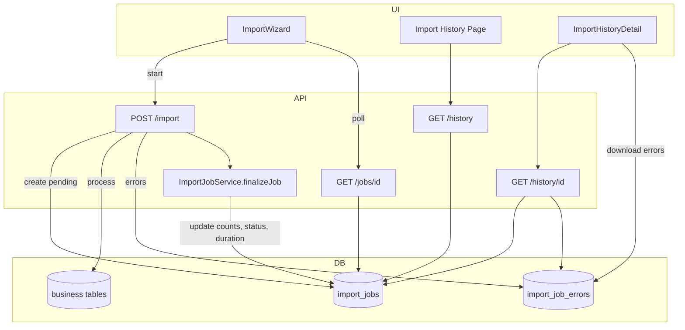
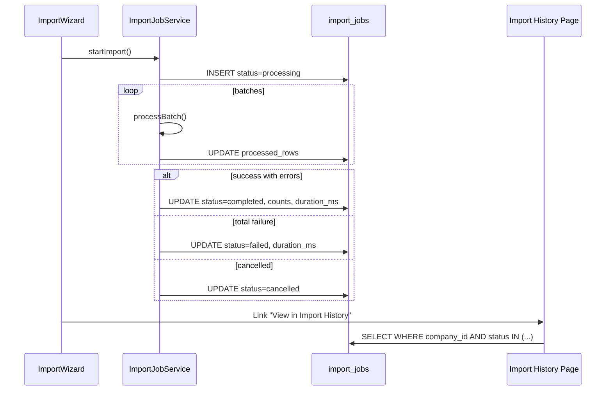
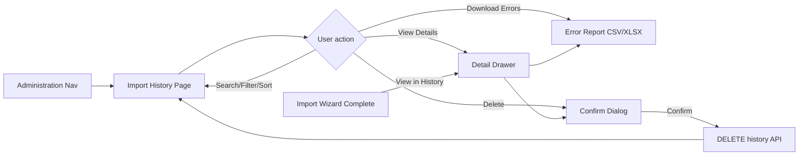

# Hisab.ai Platform-Wide Import/Export Framework

**Status:** Phase 1 implemented  
**Implementation:** Complete (Customers reference module)  
**Last updated:** 2026-07-03

---

## 1. Executive Summary

Hisab.ai will adopt a **registry-driven Import/Export Framework** shared by every CRUD module. Modules register a schema and thin processor hooks; the framework owns parsing, mapping, validation, duplicate resolution, processing, export, progress, error reports, audit logging, and **Import History**.

**Import History** is a first-class, lightweight feature: a dedicated Administration page where each company views past imports, filters/search/sorts results, inspects summaries, downloads error reports, and deletes history records (without touching imported business data).

**Design principles:**
- No duplicated logic between modules
- Multi-tenant isolation on every query (`company_id`)
- Extensible for queues, AI mapping, undo, analytics — without over-engineering Phase 1

---

## 2. Current State (Baseline)

| Capability | Today | Target |
|------------|-------|--------|
| CSV import | 3 modules (`expenses`, `bills`, `journal`) via `CsvImportModal` | All modules via `ImportWizard` |
| Excel import | None (`xlsx` installed, unused) | CSV + XLSX |
| Export | Invoice PDF / ZATCA XML only | CSV + XLSX per module |
| Column mapping | Fixed headers in modal CONFIG | Auto + manual + saved templates |
| Duplicate handling | None | skip / update / create |
| Import audit | None | `import_jobs` + Import History UI |
| Tenant-safe lookups | Partial (unscoped `prisma` reads in import routes) | Repository-scoped only |

**Reusable today:** `Modal`, `Button`, `Input`, `Select`, `DataTable`, `PageHeader`, `resolveCompanyId()`, repository interfaces, `entities.ts`, `getNextSequence()`, `xlsx`, `zod`.

---

## 3. Framework Architecture

```
ImportExportFramework
├── Upload Engine
├── CSV Parser
├── Excel Parser (.xlsx)
├── Export Engine
├── Header Detection
├── Auto Mapping Engine
├── Manual Mapping UI
├── Mapping Templates (per company)
├── Validation Engine
├── Preview Engine
├── Duplicate Resolution Engine
├── Import Processor
├── Error Report Generator
├── Progress Handler
├── Audit Logger
├── Import History Service          ← NEW (first-class)
└── Shared UI Components
```

Every module provides only:

- Module name / display name
- Expected fields + validation rules
- Primary key + duplicate keys
- Import processor hooks (`createRecord`, `updateRecord`, `findDuplicate`)
- Export data fetcher

Everything else is generic.

---

## 4. Proposed Folder Structure

```
src/
├── lib/
│   └── import-export/
│       ├── index.ts
│       ├── types.ts
│       ├── registry/
│       │   ├── module-registry.ts
│       │   └── modules/
│       │       ├── customers.module.ts
│       │       ├── vendors.module.ts
│       │       └── ... (one file per module)
│       ├── parsers/
│       │   ├── csv-parser.ts
│       │   ├── excel-parser.ts
│       │   └── detect-format.ts
│       ├── mapping/
│       │   ├── auto-mapper.ts
│       │   ├── synonyms.ts
│       │   ├── normalize-header.ts
│       │   └── mapping-template.service.ts
│       ├── validation/
│       │   ├── validation-engine.ts
│       │   ├── validators/
│       │   └── build-zod-schema.ts
│       ├── duplicate/
│       │   ├── duplicate-detector.ts
│       │   └── strategies.ts
│       ├── export/
│       │   ├── export-engine.ts
│       │   ├── csv-writer.ts
│       │   └── excel-writer.ts
│       ├── import/
│       │   ├── import-processor.ts
│       │   ├── batch-processor.ts
│       │   ├── row-grouper.ts
│       │   └── error-report.ts
│       ├── jobs/
│       │   ├── import-job.service.ts       # Creates/updates history records
│       │   └── progress-store.ts
│       ├── history/                          # NEW
│       │   ├── import-history.service.ts     # List, get, delete (history only)
│       │   └── import-history.types.ts
│       └── audit/
│           └── import-audit.service.ts     # Thin wrapper; writes via job service
│
├── components/
│   └── import-export/
│       ├── ImportWizard.tsx
│       ├── ExportButton.tsx
│       ├── ImportHistoryTable.tsx            # NEW — reusable table
│       ├── ImportHistoryDetail.tsx           # NEW — detail drawer/modal
│       ├── ImportHistoryFilters.tsx          # NEW — search, module, status, date
│       ├── steps/                            # Upload, Mapping, Preview, etc.
│       ├── MappingTable.tsx
│       ├── PreviewTable.tsx
│       ├── ValidationSummary.tsx
│       ├── DuplicateDialog.tsx
│       ├── ProgressModal.tsx
│       └── MappingTemplateDialog.tsx
│
└── app/
    ├── (dashboard)/
    │   └── import-history/
    │       └── page.tsx                      # NEW — dedicated page
    └── api/
        └── import-export/
            ├── [module]/
            │   ├── export/route.ts
            │   ├── template/route.ts
            │   ├── parse/route.ts
            │   ├── validate/route.ts
            │   └── import/route.ts
            ├── jobs/
            │   └── [jobId]/
            │       ├── route.ts                # GET progress / status
            │       ├── errors/route.ts         # GET error report download
            │       └── cancel/route.ts
            ├── history/                        # NEW
            │   ├── route.ts                    # GET list (paginated, filtered)
            │   └── [id]/
            │       ├── route.ts                # GET detail, DELETE history
            │       └── errors/route.ts         # GET error report (alias)
            └── mapping-templates/
                ├── route.ts
                └── [id]/route.ts
```

**Navigation:** Add **Import History** under **Administration** in `src/app/(dashboard)/layout.tsx` (alongside Settings, Users).

---

## 5. Database Schema

### 5.1 `import_jobs` (primary history + runtime record)

Single table serves **live job tracking** and **Import History**. When a job reaches a terminal state (`completed`, `failed`, `cancelled`), it becomes a history record. No separate `import_history` table in Phase 1 — avoids duplication.

```sql
-- Migration: 023_import_export_framework.sql

CREATE TABLE public.import_jobs (
  id UUID PRIMARY KEY DEFAULT gen_random_uuid(),
  company_id UUID NOT NULL REFERENCES public.companies(id) ON DELETE CASCADE,
  user_id UUID NOT NULL REFERENCES public.profiles(id) ON DELETE SET NULL,

  -- Module & file
  module_key TEXT NOT NULL,
  filename TEXT NOT NULL,
  file_format TEXT NOT NULL CHECK (file_format IN ('csv', 'xlsx')),

  -- Strategy & status
  duplicate_strategy TEXT CHECK (duplicate_strategy IN ('skip', 'update', 'create')),
  status TEXT NOT NULL DEFAULT 'pending' CHECK (status IN (
    'pending', 'parsing', 'mapping', 'validating', 'processing',
    'completed', 'failed', 'cancelled'
  )),

  -- Row counts (finalized on completion)
  total_rows INT NOT NULL DEFAULT 0,
  imported_count INT NOT NULL DEFAULT 0,
  updated_count INT NOT NULL DEFAULT 0,
  skipped_count INT NOT NULL DEFAULT 0,
  failed_count INT NOT NULL DEFAULT 0,
  processed_rows INT NOT NULL DEFAULT 0,   -- progress during processing

  -- Validation summary (for detail view)
  valid_rows INT,
  invalid_rows INT,
  warning_count INT,

  -- Timing
  started_at TIMESTAMPTZ,
  completed_at TIMESTAMPTZ,
  duration_ms INT,

  -- Snapshots (audit / detail view)
  mapping_snapshot JSONB,
  validation_summary JSONB,              -- { errorCodes: { INVALID_EMAIL: 12, ... } }
  error_summary JSONB,                   -- aggregated counts for quick display

  -- Future: original file storage path, created record IDs for undo
  -- file_storage_path TEXT,
  -- created_record_ids JSONB,

  created_at TIMESTAMPTZ NOT NULL DEFAULT now(),
  updated_at TIMESTAMPTZ NOT NULL DEFAULT now()
);

CREATE TABLE public.import_job_errors (
  id UUID PRIMARY KEY DEFAULT gen_random_uuid(),
  company_id UUID NOT NULL REFERENCES public.companies(id) ON DELETE CASCADE,
  job_id UUID NOT NULL REFERENCES public.import_jobs(id) ON DELETE CASCADE,
  row_number INT NOT NULL,
  field_key TEXT,
  error_code TEXT NOT NULL,
  message TEXT NOT NULL,
  raw_row JSONB,
  created_at TIMESTAMPTZ NOT NULL DEFAULT now()
);

CREATE TABLE public.import_mapping_templates (
  id UUID PRIMARY KEY DEFAULT gen_random_uuid(),
  company_id UUID NOT NULL REFERENCES public.companies(id) ON DELETE CASCADE,
  module_key TEXT NOT NULL,
  name TEXT NOT NULL,
  is_default BOOLEAN NOT NULL DEFAULT false,
  column_mapping JSONB NOT NULL,
  header_fingerprint TEXT,
  created_by_id UUID REFERENCES public.profiles(id) ON DELETE SET NULL,
  created_at TIMESTAMPTZ NOT NULL DEFAULT now(),
  updated_at TIMESTAMPTZ NOT NULL DEFAULT now(),
  UNIQUE (company_id, module_key, name)
);

-- Indexes
CREATE INDEX import_jobs_company_history_idx
  ON public.import_jobs (company_id, created_at DESC)
  WHERE status IN ('completed', 'failed', 'cancelled');

CREATE INDEX import_jobs_company_active_idx
  ON public.import_jobs (company_id, status)
  WHERE status IN ('pending', 'parsing', 'mapping', 'validating', 'processing');

CREATE INDEX import_jobs_company_module_idx
  ON public.import_jobs (company_id, module_key, created_at DESC);

CREATE INDEX import_job_errors_job_idx ON public.import_job_errors (job_id);
CREATE INDEX mapping_templates_company_module_idx
  ON public.import_mapping_templates (company_id, module_key);

-- RLS (same pattern as other tenant tables)
ALTER TABLE public.import_jobs ENABLE ROW LEVEL SECURITY;
ALTER TABLE public.import_job_errors ENABLE ROW LEVEL SECURITY;
ALTER TABLE public.import_mapping_templates ENABLE ROW LEVEL SECURITY;

CREATE POLICY import_jobs_tenant ON public.import_jobs
  FOR ALL TO authenticated
  USING (company_id = (SELECT company_id FROM ... tenant resolution ...));

-- (service_role bypass policy for background workers, Phase 2)
```

### 5.2 Field mapping: requirements → schema

| Requirement | Column |
|-------------|--------|
| Import ID | `id` |
| Company ID | `company_id` |
| User ID | `user_id` |
| Module Name | `module_key` (+ display name from registry) |
| File Name | `filename` |
| File Type | `file_format` (`csv` / `xlsx`) |
| Import Date & Time | `created_at` (started) / `completed_at` (finished) |
| Duplicate Strategy | `duplicate_strategy` |
| Total Rows | `total_rows` |
| Imported Rows | `imported_count` |
| Updated Rows | `updated_count` |
| Skipped Rows | `skipped_count` |
| Failed Rows | `failed_count` |
| Import Duration | `duration_ms` |
| Status | `status` |

### 5.3 Delete history semantics

**DELETE** on `import_jobs` cascades to `import_job_errors`.  
**Does NOT** delete rows in `customers`, `vendors`, etc.  
`created_record_ids` (Phase 2) would be nulled on delete to prevent accidental undo after history removal.

---

## 6. Import History — Feature Design

### 6.1 Page location

- **Route:** `/import-history`
- **Nav:** Administration → Import History
- **Access:** All authenticated users with company membership (same as Settings)
- **Scope:** `company_id` from `resolveCompanyId()` — never cross-tenant

### 6.2 List view (table)

Reuse `DataTable` / existing table patterns from `customers/page.tsx`, `bills/page.tsx`.

| Column | Source |
|--------|--------|
| Date & Time | `completed_at` ?? `created_at` |
| User | Join `profiles.full_name` via `user_id` |
| Module | Registry `displayName` from `module_key` |
| File Name | `filename` |
| File Type | `file_format` (uppercase: CSV, XLSX) |
| Total Rows | `total_rows` |
| Imported | `imported_count` |
| Updated | `updated_count` |
| Skipped | `skipped_count` |
| Failed | `failed_count` |
| Duration | `duration_ms` → formatted (`12.4s`) |
| Status | Badge: Completed / Failed / Cancelled / Processing |

**Default sort:** `created_at DESC`  
**Default filter:** Terminal statuses only (`completed`, `failed`, `cancelled`) — hide in-progress unless user filters for "Processing"

### 6.3 Filters & search

| Control | Implementation |
|---------|----------------|
| Search by filename | `ILIKE` on `filename` |
| Filter by module | `module_key = ?` (dropdown from registry) |
| Filter by status | `status IN (...)` |
| Filter by date range | `created_at BETWEEN ? AND ?` |
| Pagination | `page`, `limit` (default 25) |
| Sorting | `sortBy`, `sortDir` on allowed columns |

Reuse `SearchBar`, `FilterBar`, `PageHeader` from `src/components/ui/page-header.tsx`.

### 6.4 Row actions

| Action | Behavior |
|--------|----------|
| **View Details** | Open `ImportHistoryDetail` drawer/modal |
| **Download Error Report** | Visible only if `failed_count > 0` or errors exist; `GET /api/import-export/history/[id]/errors?format=csv` |
| **Delete** | Confirm dialog → `DELETE /api/import-export/history/[id]` — removes job + errors only |

### 6.5 Detail view

`ImportHistoryDetail` shows:

- **Import summary:** module, filename, file type, date/time, user, status
- **Duplicate strategy:** Skip / Update / Create Duplicate
- **Validation summary:** valid / invalid / warning counts; top error codes from `validation_summary`
- **Row counts:** imported, updated, skipped, failed (with progress bar visual)
- **Duration:** formatted `duration_ms`
- **Mapping snapshot:** read-only view of column mapping used (from `mapping_snapshot`)
- **Actions:** Download Error Report, Delete History

### 6.6 Integration with Import Wizard completion

On **every terminal job outcome**, `ImportJobService.finalizeJob()` writes final counts and sets `completed_at` / `duration_ms`. History appears automatically — no separate "create history" step.

| Outcome | `status` | History visible? |
|---------|----------|------------------|
| All rows imported | `completed` | Yes |
| Partial success | `completed` | Yes (failed_count > 0) |
| Fatal error (no rows) | `failed` | Yes |
| User cancelled | `cancelled` | Yes |
| In progress | `processing` | Optional in list via status filter |

**Completion step (Import Wizard Step 9)** includes link: *"View in Import History"* → `/import-history?id={jobId}`.

---

## 7. API Endpoints (Complete)

### 7.1 Import / Export (unchanged from base design)

| Method | Endpoint | Purpose |
|--------|----------|---------|
| `GET` | `/api/import-export/[module]/export?format=csv\|xlsx` | Export |
| `GET` | `/api/import-export/[module]/template?format=csv\|xlsx` | Template download |
| `POST` | `/api/import-export/[module]/parse` | Parse uploaded file |
| `POST` | `/api/import-export/[module]/auto-map` | Suggest column mapping |
| `POST` | `/api/import-export/[module]/validate` | Validate mapped rows |
| `POST` | `/api/import-export/[module]/detect-duplicates` | Duplicate preview |
| `POST` | `/api/import-export/[module]/import` | Start job → `{ jobId }` |
| `GET` | `/api/import-export/jobs/[jobId]` | Live progress |
| `GET` | `/api/import-export/jobs/[jobId]/errors?format=csv\|xlsx` | Error report (during/after import) |
| `POST` | `/api/import-export/jobs/[jobId]/cancel` | Cancel job |

### 7.2 Import History (NEW)

| Method | Endpoint | Purpose |
|--------|----------|---------|
| `GET` | `/api/import-export/history` | Paginated list with filters |
| `GET` | `/api/import-export/history/[id]` | Single record + user name + validation summary |
| `DELETE` | `/api/import-export/history/[id]` | Delete history + errors (not business data) |
| `GET` | `/api/import-export/history/[id]/errors?format=csv\|xlsx` | Download error report |

**List query parameters:**

```
?page=1&limit=25
&search=customers-jan.csv
&module=customers
&status=completed,failed
&dateFrom=2026-01-01&dateTo=2026-06-30
&sortBy=created_at&sortDir=desc
&includeActive=false          # default: terminal statuses only
```

**List response:**

```typescript
{
  items: ImportHistoryRecord[]
  total: number
  page: number
  limit: number
}
```

**Detail response:**

```typescript
{
  id: string
  moduleKey: string
  moduleDisplayName: string
  filename: string
  fileFormat: 'csv' | 'xlsx'
  duplicateStrategy: 'skip' | 'update' | 'create' | null
  status: ImportJobStatus
  totalRows: number
  importedCount: number
  updatedCount: number
  skippedCount: number
  failedCount: number
  validRows: number | null
  invalidRows: number | null
  warningCount: number | null
  durationMs: number | null
  createdAt: string
  completedAt: string | null
  user: { id: string; name: string | null }
  mappingSnapshot: Record<string, string> | null
  validationSummary: Record<string, number> | null
  hasErrorReport: boolean
}
```

### 7.3 Mapping templates (unchanged)

| Method | Endpoint |
|--------|----------|
| `GET` | `/api/import-export/mapping-templates?module=` |
| `POST` | `/api/import-export/mapping-templates` |
| `PUT` | `/api/import-export/mapping-templates/[id]` |
| `DELETE` | `/api/import-export/mapping-templates/[id]` |

---

## 8. Data Flow — Import with History





---

## 9. Import History UI Flow



---

## 10. Module Registration (unchanged)

Modules register via `ModuleDefinition` (see Phase 0 doc). Import History does not require per-module configuration — it reads `module_key` and resolves display name from the registry.

---

## 11. Import Wizard Steps (unchanged)

1. Upload (CSV / XLSX, drag & drop)
2. Header detection
3. Auto mapping
4. Manual mapping (if required fields unmapped)
5. Preview (20 rows, original + mapped)
6. Validation
7. Duplicate resolution
8. Import (progress)
9. Completion → **link to Import History**

---

## 12. Security

| Concern | Mitigation |
|---------|------------|
| Cross-tenant history | All queries `WHERE company_id = resolveCompanyId()` |
| Delete imported data | DELETE only on `import_jobs` / `import_job_errors` |
| Error report PII | Same tenant scope; auth required |
| Job ID enumeration | UUIDs; 404 if job not in tenant |

---

## 13. Future-Ready (Import History extensions)

| Feature | Extension point |
|---------|-----------------|
| Download original file | `file_storage_path` on `import_jobs` |
| Re-run import | Reuse `mapping_snapshot` + stored file |
| Undo import | `created_record_ids JSONB` + undo endpoint |
| Import analytics | Aggregate queries on `import_jobs` |
| Audit reporting | Export `import_jobs` for compliance |
| Email on completion | Webhook from `finalizeJob()` |

Phase 1 columns commented in schema; no implementation until requested.

---

## 14. Implementation Phases (revised)

### Phase 1 — Framework Core + History foundation

- [x] DB migration (`import_jobs`, `import_job_errors`, `import_mapping_templates`)
- [x] Module registry + `customers` module
- [x] Parsers, auto-mapper, validation, export engine
- [x] `ImportJobService` with `finalizeJob()` → history record
- [x] `ImportWizard` (7 UI steps)
- [x] **Import History page** (list, filters, pagination, sort)
- [x] **Import History detail** + delete + error report download
- [x] Nav entry under Administration
- [x] `customers` import/export integration

### Phase 2 — Module rollout

- [ ] Register remaining flat modules (vendors, inventory, employees, accounts, cost centers, tax rates)
- [x] Mapping templates (save + auto-load by fingerprint)
- [x] Duplicate strategies
- [ ] Row grouping for bills/journal/payroll
- [ ] Migrate legacy `CsvImportModal` routes

### Phase 3 — Scale

- [ ] Background queue for large files
- [ ] Original file storage
- [ ] Import analytics / undo

---

## 15. Migration from Current Code

| Current | Action |
|---------|--------|
| `CsvImportModal` | Replace with `ImportWizard`; remove in Phase 2 |
| `/api/*/import` | Delegate to framework |
| No history | All imports write to `import_jobs` automatically |

---

## 16. Resolved Open Questions (from Phase 0)

| Question | Decision for Phase 1 |
|----------|----------------------|
| File storage | Parse-and-discard; `file_storage_path` column reserved |
| Row limits | 10,000 sync; architecture supports async for 100k+ |
| History table | Reuse `import_jobs` (no duplicate table) |
| Delete semantics | History + errors only; never business data |
| Nav placement | Administration → Import History |

---

## 17. Deliverables Checklist (before coding)

- [x] Revised database schema with history fields
- [x] Revised folder structure (`history/`, `import-history/page.tsx`)
- [x] Import History UI design (table, filters, detail, actions)
- [x] API endpoints for history CRUD + error download
- [x] Data flow integration with `ImportJobService.finalizeJob()`
- [x] Future-ready extension points documented
- [x] **Implementation** — Phase 1 complete (Customers reference module)

---

## 18. Production Audit (2026-07-03)

Phase 1 audit completed. Refinements applied without new features.

### Security hardening applied

| Control | Implementation |
|---------|----------------|
| Row limit | `MAX_IMPORT_ROWS` (10,000) enforced on parse, validate, and import |
| File size limit | `MAX_UPLOAD_BYTES` (10 MB) on parse |
| CSV formula injection | `sanitizeExportCell()` prefixes `=`, `+`, `-`, `@`, tab in exports and error reports |
| Duplicate CSV headers | Rejected at parse with clear error |
| Mapping conflicts | One source column per target field enforced |
| Tenant errors | `TenantAccessError` → HTTP 403 |
| Unknown module | `FrameworkNotFoundError` → HTTP 404 |
| Auth | `requireAuth()` on every endpoint |

### Performance hardening applied

| Area | Implementation |
|------|----------------|
| Duplicate detection | `findDuplicatesBatch()` on customers module (3 queries max vs N+1) |
| Import reuse | Validate duplicates passed to import — no second full scan when wizard provides them |
| Export | `includeOutstanding: false` for export queries; `MAX_EXPORT_ROWS` (50,000) cap |
| Error persistence | Batched inserts (500 rows per chunk) |

### Reliability hardening applied

| Area | Implementation |
|------|----------------|
| Failed imports | Jobs finalized as `failed` on unexpected exceptions |
| Update strategy | No silent create when duplicate expected but not found |
| History delete | Returns 404 when record not found |
| Module display | Unknown `module_key` in history falls back to raw key (no crash) |
| Job cancellation | DB-backed status only (removed in-memory cancel set) |
| Migration fix | `024_import_jobs_user_fk_fix.sql` — `user_id ON DELETE RESTRICT` |

### Known Phase 1 limitations (documented, not bugs)

| Limitation | Notes |
|------------|-------|
| Sync import | Entire import runs in one HTTP request; large files may timeout |
| Client-held rows | Parsed rows sent on validate + import; no server-side file storage |
| Unused API routes | `auto-map`, `detect-duplicates` available but wizard uses parse/validate |
| History UI sorting | API supports column sort; UI uses fixed `created_at DESC` |
| Legacy importers | `CsvImportModal` still used by expenses/bills/journal |
| MIME validation | Format detected by filename extension only |

---

## 19. Module Registration Guide

To add a new module (e.g. Vendors):

### 1. Field definitions (client-safe)

Create `src/lib/import-export/registry/modules/vendors.fields.ts`:

```typescript
import type { FieldDefinition } from '../../types'

export const VENDOR_FIELDS: FieldDefinition[] = [
  { key: 'name', label: 'Name', type: 'string', required: true, exportOrder: 1 },
  // ...
]
```

### 2. Module definition (server-only)

Create `src/lib/import-export/registry/modules/vendors.module.ts`:

- Implement `findDuplicate`, `findDuplicatesBatch` (recommended), `createRecord`, `updateRecord`, `exportRecords`, `mapExportRow`
- Use repository pattern with `resolveCompanyId()` — never unscoped queries
- Export should pass `includeOutstanding: false` or equivalent if applicable

### 3. Register module

Add to `src/lib/import-export/registry/module-catalog.ts`:

```typescript
{ key: 'vendors', displayName: 'Vendors' },
```

Register in `module-registry.ts`:

```typescript
[vendorsModule.key, vendorsModule],
```

### 4. Wire UI

On the module page:

```tsx
<ExportButton moduleKey="vendors" filters={currentFilters} />
<ImportWizard moduleKey="vendors" moduleLabel="Vendors" fields={VENDOR_FIELDS} ... />
```

### 5. Apply migration

No new tables needed — framework tables are shared.

---

## 20. Actual Folder Structure (implemented)

```
src/lib/import-export/
├── types.ts, errors.ts, api-helpers.ts, index.ts
├── security/sanitize-cell.ts
├── parsers/ (csv, excel, detect-format)
├── mapping/ (auto-mapper, synonyms, normalize-header, mapping-template.service)
├── validation/validation-engine.ts
├── duplicate/ (duplicate-detector, strategies)
├── export/export-engine.ts
├── import/ (import-processor, error-report)
├── jobs/import-job.service.ts
├── history/ (import-history.service, import-history.types)
└── registry/ (module-registry, module-catalog, modules/)

src/components/import-export/
├── ImportWizard, ExportButton, ValidationSummary, MappingTemplateDialog
├── ImportHistoryTable, ImportHistoryDetail, ImportHistoryFilters
└── steps/ (Upload, Mapping, Preview, Duplicate)

src/app/api/import-export/
├── _lib/ (module-params, parse-import-body)
├── [module]/ (export, template, parse, validate, import, auto-map, detect-duplicates)
├── jobs/[jobId]/ (route, errors, cancel)
├── history/ (route, [id], [id]/errors)
└── mapping-templates/ (route, [id])
```

**Not implemented (future):** `csv-writer.ts`, `excel-writer.ts`, `batch-processor.ts`, `progress-store.ts`, `audit/import-audit.service.ts` — logic consolidated into existing files.

---

## 21. Wizard Flow (implemented — 7 UI steps)

1. Upload (CSV / XLSX)
2. Column mapping (auto + manual, save template)
3. Preview (original + client-mapped preview)
4. Validation (errors block rows; warnings allow continue)
5. Duplicate strategy (skip / update / create)
6. Import (sync processing with progress indicator)
7. Completion (summary + link to Import History)

---

## 22. Migration Readiness

| Module | Ready? | Notes |
|--------|--------|-------|
| **Vendors** | Yes | Copy customers pattern; add batch duplicate lookup |
| **Inventory** | Yes | Straightforward flat schema |
| **Employees** | Yes | Straightforward flat schema |
| **Expenses** | Partial | Line-level import; may need row grouping (Phase 2 pattern) |
| **Bills** | Partial | Multi-row grouping like legacy importer |
| **Journal** | Partial | Debit/credit grouping + balance validation |
| **Accounts** | Yes | Flat COA import; hierarchy optional |
| **Payroll** | Partial | Header + lines grouping |
| **Cost Centers** | Yes | Flat schema |
| **Tax Rates** | Yes | Flat schema |
| **Invoices** | No | Complex lines, ZATCA fields — defer to dedicated phase |

**Recommendation:** Proceed with Vendors, Inventory, Employees, Accounts, Cost Centers, Tax Rates. Defer Expenses, Bills, Journal, Payroll (grouping), and Invoices until row-grouper pattern is implemented.

---

*End of architecture document.*
